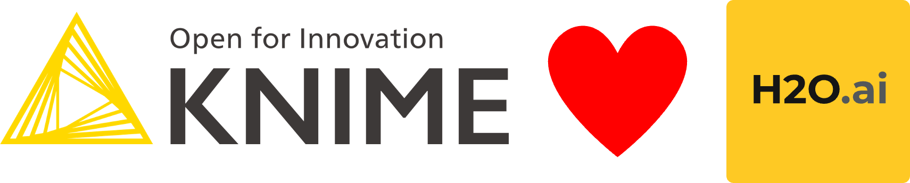

A small collection of Jupyter notebooks (under /notebooks/) with advanced machine-learning algorithms. Used in cooperation with KNIME workflows but also can be used standalone. The results can be integrated in KNIME like being demonstrated in these articles (where you will also find the links to the KNIME workflows)

Hyperparameter optimization for LightGBM — wrapped in KNIME nodes

https://medium.com/p/ddb7ae1d7e2

**KNIME, XGBoost and Optuna for Hyper Parameter Optimization**

https://medium.com/p/dcf0efdc8ddf

**Data preparation for Machine Learning with KNIME and the Python “vtreat” package**

https://medium.com/p/efcaf58fa783

--------------------

This article might also be relevant if you want to learn how to setup a conda environment - and also integrate that with KNIME

**KNIME and Python — Setting up and managing Conda environments**

https://medium.com/p/2ac217792539

**py3_knime_lightgbm.yml** - is the YAML configuration file to set up the environment

--------------------
The training data used is:

Census Income Data Set
Abstract: Predict whether income exceeds $50K/yr based on census data. Also known as "Adult" dataset.

Extract and prepare the Census Income Files for usage in KNIME

https://archive.ics.uci.edu/ml/datasets/census+income
