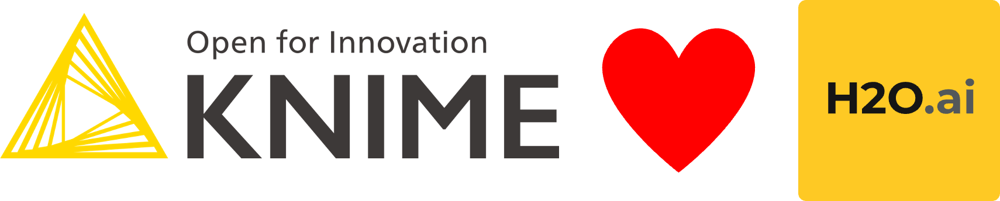

### Am small collection of Jupyter motebooks to solve REGRESION tasks.

On the KNIME Hub there are some examples how to solve regression tasks with KNIME workflows. The Python notebooks presented here will later be included in KNIME workflows ... probably ....

#### H2O.ai AutoML in KNIME for regression problems

https://forum.knime.com/t/h2o-ai-automl-in-knime-for-regression-problems/20924?u=mlauber71

If you are intersted in more regression taks but with KNIME you can check out: 

### Score Kaggle House Prices: Advanced Regression Techniques - prepare data with vtreat - use H2O.ai nodes and other models - measure results with RMSE

https://hub.knime.com/-/spaces/-/~_4d8QTJEXO50qzi7/current-state/
